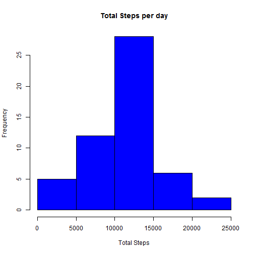
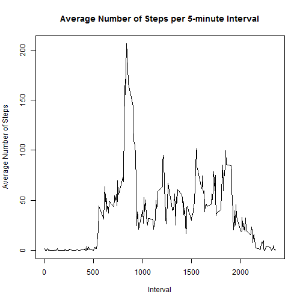
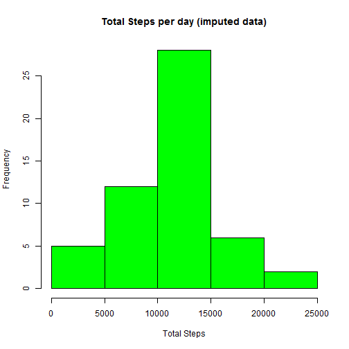
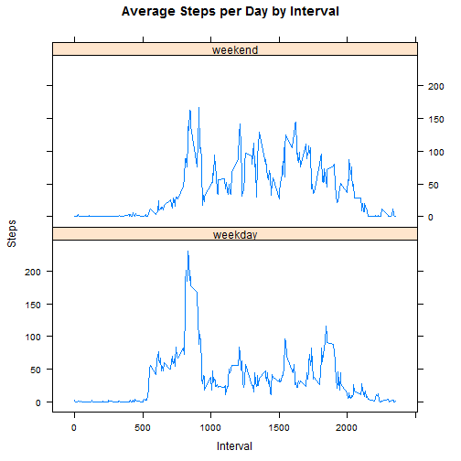

This report will describe the analyses and visualization used to complete the week 2 
programming assignment for the Coursera reproducible research class.

Opening the data

```r
activity <- read.csv("activity.csv", header=TRUE)
```

What is mean total number of steps taken per day?
Calcuating total steps per day

```r
total_steps <- aggregate(steps ~ date, data=activity, FUN = sum)
```

Histogram of total steps per day

```r
hist(total_steps$steps, col='blue', main = "Total Steps per day", xlab="Total Steps")
```



Show the mean and median total steps per day

```r
mean(total_steps$steps)
```

```
## [1] 10766.19
```

```r
median(total_steps$steps )
```

```
## [1] 10765
```


What is the daily active pattern?

Calculate average steps (across all days) per 5-minute interval

```r
mean_interval <- aggregate(steps ~ interval, data=activity, mean)
```

Time series plot of the 5-minute interval and average number of steps taken averaged
across all days

```r
plot(mean_interval$interval, mean_interval$steps, type="l", lty=1, xlab="Interval", ylab="Average Number of Steps", main="Average Number of Steps per 5-minute Interval")
```



Calculate which 5-minute interval, on average across all days, has the maximum number of steps


```r
##calculating the max
max_interval <- which.max(mean_interval$steps)
##Getting which interval has the maximum value
mean_interval[max_interval,]
```

```
##     interval    steps
## 104      835 206.1698
```

Imputing Missing Values

Calculate the number of missing values

```r
sum(is.na(activity$steps))
```

```
## [1] 2304
```

Impute missing values into the mean for the given 5-minute interval

```r
activity2 <- activity
activity2$steps[is.na(activity2$steps)] <- tapply(activity2$steps, activity2$interval, mean, na.rm=TRUE)
```
Double checking there are no missing values in new data

```r
sum(is.na(activity2$steps))
```

```
## [1] 0
```
Calculate the new total steps per day and create a histogram 

```r
## Get new total steps per day using imputed data
total_steps2 <- aggregate(steps ~ date, data=activity2, FUN = sum)
## Make new histogram using imputed data
hist(total_steps$steps, col='green', main = "Total Steps per day (imputed data)", xlab="Total Steps")
```


Report new mean and median using the imputed data

```r
mean(total_steps2$steps)
```

```
## [1] 10766.19
```

```r
median(total_steps2$steps)
```

```
## [1] 10766.19
```

The mean total steps per day reamined the same but the median differs slightly

Are there differences in activity patters between weekdays and weekends?

```r
activity2$date <- as.Date(activity2$date)
activity2$day <- weekdays(activity2$date)
activity2$daycat <- as.factor(ifelse(activity2$day == "Saturday" | activity2$day == "Sunday", "weekend", "weekday"))
```
Make to compare the average number of steps taken on a weekday vs the weekend (using imputed data). 

```r
##Calculate new mean steps per interval using imputed data
mean_day <- aggregate(steps ~ interval + daycat, data=activity2, mean)
library(lattice)
xyplot(mean_day$steps ~ mean_day$interval|mean_day$daycat , main="Average Steps per Day by Interval",xlab="Interval", ylab="Steps",layout=c(1,2), type="l")
```




